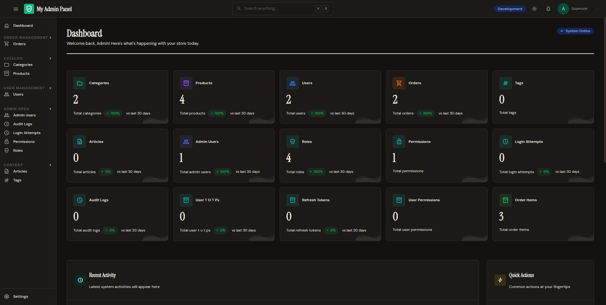

# FastAPI Admin Kit

[](https://pypi.org/project/fastapi-admin-kit/)
[](https://pypi.org/project/fastapi-admin-kit/)
[](https://github.com/borhanst/fastapi-admin-kit/blob/main/LICENSE)
[](https://github.com/borhanst/fastapi-admin-kit/actions/workflows/tests.yml)

A drop-in admin panel for FastAPI + SQLAlchemy + SQLModel apps, inspired by Django Unfold.



📖 **[Documentation](https://borhanst.github.io/fastapi-admin-kit/)** | 🚀 **[Quick Start](#quick-start)** | 📦 **[PyPI](https://pypi.org/project/fastapi-admin-kit/)**

## Features

> See the **[Full Features List](https://borhanst.github.io/fastapi-admin-kit/guide/features/)** for every feature with detailed docs links.

- **Zero-Config Auto-Discovery** — Register a model, get full CRUD UI automatically
- **SQLAlchemy & SQLModel** — Works with both ORMs out of the box
- **Built-in Auth & RBAC** — Session-based auth with role-based permissions per model
- **Audit Logging** — Every create, update, and delete is recorded with full diffs
- **Modern UI** — Tailwind CSS, HTMX, and Alpine.js with dark mode
- **17 Built-in Widgets** — TextInput, Toggle, DatePicker, FileUpload, Wysiwyg, and more
- **Inline Editing** — Edit records directly from list view with 3-dot action menu
- **Command Palette** — `Cmd+K` / `Ctrl+K` global search across models and fields
- **JSON API** — REST endpoints with JWT token auth for external frontends
- **Dashboard** — Configurable stat cards, charts, tables, and progress bars
- **CLI Tools** — `fak-admin` / `fak` for superuser management and project scaffolding
- **Pagination** — Offset, cursor, or dynamic strategies per model
- **Filters** — Text, boolean, relation, and enum sidebar filters
- **File Uploads** — Built-in local storage backend with upload widgets
- **Async-First** — PostgreSQL, MySQL, and SQLite with auto URL normalization
- **CSRF & Rate Limiting** — Security built-in out of the box

## Installation

```bash
# pip
pip install fastapi-admin-kit

# uv
uv add fastapi-admin-kit
```

For database-specific async drivers:

```bash
# pip
pip install fastapi-admin-kit[postgres]  # PostgreSQL via asyncpg
pip install fastapi-admin-kit[mysql]     # MySQL via aiomysql

# uv
uv add fastapi-admin-kit[postgres]  # PostgreSQL via asyncpg
uv add fastapi-admin-kit[mysql]     # MySQL via aiomysql
```

For the full experience with uvicorn and JWT support:

```bash
# pip
pip install fastapi-admin-kit[full]

# uv
uv add fastapi-admin-kit[full]
```

## Quick Start

```python
import os
import secrets
from contextlib import asynccontextmanager

from fastapi import FastAPI
from sqlalchemy import Column, Float, Integer, String
from sqlalchemy.ext.asyncio import AsyncSession, create_async_engine
from sqlalchemy.orm import DeclarativeBase, relationship, sessionmaker

from fastapi_admin_kit import Admin
from fastapi_admin_kit.auth.backend import BuiltinAuthBackend
from fastapi_admin_kit.auth.mixins import AuthModelMixin
from fastapi_admin_kit.auth.models import Role, admin_user_roles


class Base(DeclarativeBase):
    pass


class User(AuthModelMixin, Base):
    __tablename__ = "users"
    id = Column(Integer, primary_key=True)
    email = Column(String(255), unique=True, nullable=False)
    full_name = Column(String(255))

    roles = relationship(
        "Role", secondary=admin_user_roles, back_populates="users"
    )


class Product(Base):
    __tablename__ = "products"
    id = Column(Integer, primary_key=True)
    name = Column(String(100), nullable=False)
    price = Column(Float, nullable=False)


DATABASE_URL = os.getenv("DATABASE_URL", "sqlite+aiosqlite:///./app.db")
SECRET_KEY = os.getenv("SECRET_KEY", secrets.token_urlsafe(32))

engine = create_async_engine(DATABASE_URL)
async_session = sessionmaker(engine, class_=AsyncSession)


@asynccontextmanager
async def lifespan(app: FastAPI):
    async with engine.begin() as conn:
        await conn.run_sync(Base.metadata.create_all)
    await admin.setup()
    yield
    await engine.dispose()


app = FastAPI(lifespan=lifespan)
admin = Admin(
    app=app,
    engine=engine,
    base=Base,
    secret_key=SECRET_KEY,
    auth_model=User,
    auth_backend=BuiltinAuthBackend(),
)
admin.register(Product)
```

Run with:

```bash
pip install fastapi-admin-kit[full]
uvicorn main:app --reload
```

Open [http://localhost:8000/admin/](http://localhost:8000/admin/) and log in with:

- **Email:** `admin@example.com`
- **Password:** `admin`

!!! warning
    Change the default password immediately in production!

## CLI Usage

Both the full name and the short alias work interchangeably:

```bash
# Create a superuser
fak-admin createsuperuser -e admin@example.com -p mypassword
fak createsuperuser -e admin@example.com -p mypassword       # short alias

# List all admin users
fak-admin users
fak users

# Change a user's password
fak-admin changepassword -e admin@example.com -p newpassword
fak changepassword -e admin@example.com -p newpassword

# Scaffold a new fastapi project
fak init myproject

# Permission management
fak createpermissions --base myapp.models.Base
fak createpermissions myapp.models.User myapp.models.Product
```

All commands accept `-d DATABASE_URL` or read the `DATABASE_URL` environment variable.

## Configuration

### Environment Variables

| Variable | Description | Default |
|---|---|---|
| `DATABASE_URL` | Async database connection string | `sqlite+aiosqlite:///./app.db` |
| `SECRET_KEY` | Signing key for sessions/CSRF/JWT (min 32 chars) | Auto-generated if unset |

### Admin Options

```python
from fastapi_admin_kit import Admin
from fastapi_admin_kit.config import ThemeConfig

admin = Admin(
    app=app,
    engine=engine,
    base=Base,
    secret_key=SECRET_KEY,
    title="My Admin",           # Admin panel title
    admin_path="/admin",        # URL prefix
    dark_mode_default=False,    # Dark mode on by default
    # Auth
    auth_backend=BuiltinAuthBackend(),
    # Environment badge
    environment_label="Production",
    environment_color="danger",
)
```

### Database Support

- **SQLite** (default, built-in via `aiosqlite`)
- **PostgreSQL**: `pip install fastapi-admin-kit[postgres]` + set `DATABASE_URL=postgresql+asyncpg://...`
- **MySQL**: `pip install fastapi-admin-kit[mysql]` + set `DATABASE_URL=mysql+aiomysql://...`

### Optional Dependencies

| Extra | Packages | When to use |
|---|---|---|
| `full` | `uvicorn`, `pyjwt` | Running the dev server or using JWT API auth |
| `postgres` | `asyncpg` | PostgreSQL databases |
| `mysql` | `aiomysql` | MySQL databases |
| `sqlmodel` | `sqlmodel` | Using SQLModel models |
| `docs` | `mkdocs`, `mkdocs-material` | Building documentation |

## Security

- Session cookies use `SameSite=Strict` and `Secure` by default
- CSRF protection on all state-changing requests
- Rate limiting on authentication endpoints
- Passwords hashed with bcrypt
- SQL injection prevention via identifier validation
- Secret key validated to be >= 32 characters at startup

## Development

```bash
# Install with dev dependencies
uv sync

# Run tests with coverage
uv run pytest --cov=fastapi_admin_kit

# Lint
uv run ruff check fastapi_admin_kit/

# Format
uv run ruff format fastapi_admin_kit/

# Build distribution
uv build
```

## License

MIT
